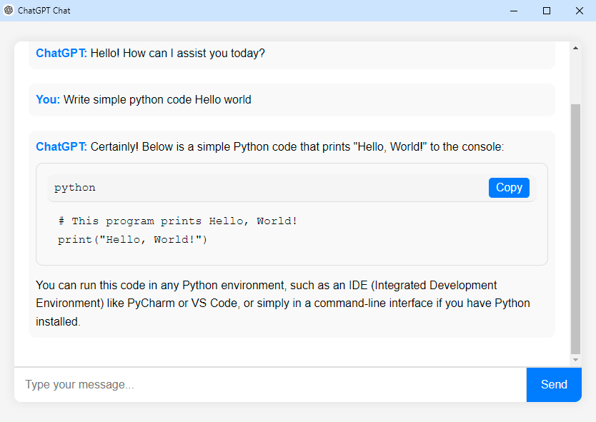

<h1 align="center">ChatGPT-Chat</h1>

<p align="center">
  
  <p align="center">This is a simple Chat Application that uses Eel to connect Python with a web interface. The backend is powered by Python, and the frontend is built using HTML, CSS, and JavaScript. The application uses the ChatGPT API for generating responses.</p>
</p>

## Features

- **Interactive Chat Interface**: Communicate with the ChatGPT model in a user-friendly chat interface.
- **Code Snippet Handling**: Display and copy code snippets directly from the chat.
- **Persistent Chat History**: Save and load chat history using localStorage.
- **Configurable Settings**: Easily configure ChatGPT and Eel settings.

## Installation

1. Clone the repository:
    ```bash
    git clone https://github.com/Tsimbalist/ChatGPT-Chat.git
    ```

2. Navigate to the project directory:

    ```bash
    cd ChatGPT-Chat
    ```

3. Install dependencies:
    ```bash
    pip install -r requirements.txt
    ```

## Configuration

The application can be configured through the `config.py` file:

```python
CHATGPT_CONFIG = {
    'version': "gpt-3.5-turbo",
    'api_key': "",
    'role': "user"
}

EEL_SETTINGS = {
    'mode': 'chrome',
    'size': (850, 600),
    'host': 'localhost',
    'port': 8080,
}
```

## Usage

1. Configure your ChatGPT API key in `config.py`.

2. Start the application:
    ```bash
    python main.py
    ```

3. The application will open in a Chrome window. If Chrome is not installed or you prefer another browser, adjust the `EEL_SETTINGS` in `config.py`.
